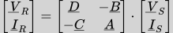
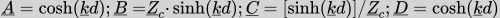
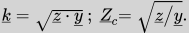
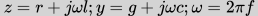

# AC three-phase power line dashboard
This repository contains the source code of the dashboard available [here](https://powerlines-interactive.herokuapp.com/).

The dashboard plots the phase voltage, current and the delivered complex power depending on the line length.

The line properties may be defined in two ways. One consists in specifying the values of the kilometric resistivity (_r_), inductance (_l_) and shunt kilometric capacity (_c_) and conductivity (_g_). The other one consists in directly specifying the typical _Zc_ and _k_ line parameters. The electrical frequency may be customized as well.

## Model
The model employed is the usual matrix formulation to compute the electrical quantities at the recieving end (R) from those at the sending end (S):

where:

being _d_ the line length and

Lastly, _z_ and _y_ are defined as:

## Implementation
This dashboard is implemented using the Python library _dash_ <mettere link>.
See `requirements.txt` for a comprehensive list of the dependencies.

## References
Benato, R., & Paolucci, A. (2010). _EHV AC undergrounding electrical power_. Springer London.
